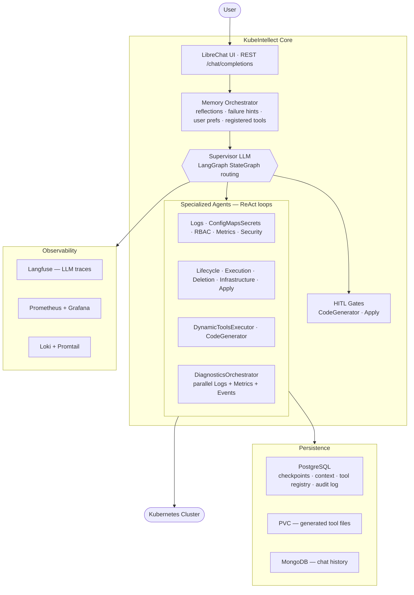

# KubeIntellect

[](LICENSE)
[](https://www.python.org)
[](https://github.com/MSKazemi/kubeintellect/pkgs/container/kubeintellect-release)
[](https://github.com/MSKazemi/kubeintellect/actions/workflows/docker-ghcr.yml)
[](https://mskasemi.github.io/kubeintellect/)

**Chat with your Kubernetes cluster in plain English. Get root cause analysis, not just log dumps.**

KubeIntellect is an AI-powered Kubernetes management platform. Describe a problem — a `CrashLoopBackOff`, a pending pod, an RBAC error — and a multi-agent LLM system diagnoses it, proposes a fix, shows you a dry-run diff, and waits for your approval before touching anything.

---

## Why KubeIntellect

Most Kubernetes tooling is reactive: you know what to look for and the tool fetches it. KubeIntellect flips this. You describe what's wrong and it figures out where to look — correlating logs, metrics, events, and configuration across multiple signals in parallel.

| Without KubeIntellect | With KubeIntellect |
|---|---|
| `kubectl logs` → grep → check events → describe pod → repeat | "Why is my pod crashing?" → full root cause in one response |
| Manual dry-run before every apply | Every write operation shows a diff and waits for your approval |
| Write a one-off script for a missing kubectl command | CodeGenerator writes, sandboxes, and registers a reusable tool |
| Context lost between sessions | Per-user memory: namespace context, preferences, routing lessons, failure patterns |

---

## What You Can Do

```
> Why is my payment-api pod crashing in the prod namespace?
→ Fetches logs, events, and resource config in parallel
→ "OOMKilled: container hit 256Mi limit. Last 3 events: BackOff restarts.
   Recommendation: increase memory limit to 512Mi. Show diff? [approve/deny]"

> Who has cluster-admin access?
→ "3 service accounts have cluster-admin: default/tiller, kube-system/admin-sa,
   kubeintellect/core-sa. Tiller is not in use — consider revoking."

> I need a tool that shows pods sorted by restart count
→ "Generating tool... [HITL: review code before I register it]"
   [approve] → "Tool registered. Running: ..."
   pod/api-6d4f9b 14 restarts | pod/worker-2 3 restarts | ...

> Scale down the staging namespace deployments to 0 replicas overnight
→ "I'll scale: api (3→0), worker (2→0), cron (1→0). Dry-run diff attached.
   Confirm? [approve/deny]"
```

**16 built-in fault scenarios** in [`tests/eval/corpus/fault_scenarios/`](tests/eval/corpus/fault_scenarios/) — CrashLoopBackOff, ImagePull errors, OOMKilled, PVC unbound, RBAC denied, quota exceeded, and more.

---

## Demo

**Deployment scenarios — deploy, scale, rollout, apply with diff:**

[](https://asciinema.org/a/mfNi0Jxn5pUgRu5V)

**Debugging — root cause analysis, CrashLoopBackOff, OOMKilled:**
[▶ Watch on asciinema](https://asciinema.org/a/nVyGUZ8VT25j3yMh)


---

## Quick Start

Everything is managed through the Makefile. Run `make help` for the full reference.

### Local — Kind (no cloud needed)

**Prerequisites:** [Docker](https://docs.docker.com/get-docker/) · [kind](https://kind.sigs.k8s.io/docs/user/quick-start/#installation) · [kubectl](https://kubernetes.io/docs/tasks/tools/) · [helm](https://helm.sh/docs/intro/install/) · [uv](https://docs.astral.sh/uv/getting-started/installation/)

```bash
# 1. Clone
git clone https://github.com/MSKazemi/kubeintellect.git && cd kubeintellect

# 2. Configure credentials (see Credentials Setup below)
cp .env.example .env
#  → set AZURE_OPENAI_API_KEY (or your provider's key) in .env
#  → set AZURE_OPENAI_ENDPOINT in charts/kubeintellect/values-kind.yaml

# 3. Deploy — creates a Kind cluster, deploys all services, generates secrets from .env
make kind-kubeintellect-clean-deploy     # ~8 min on first run

# 4. Enable hot-reload dev mode (Python changes reflect in ~2s)
make kind-dev-deploy

# 5. Open the chat UI
open http://kubeintellect.chat.local     # or: make port-forward-librechat → localhost:3080
```

Access summary is printed at the end of every deploy. Run `make help` for all available targets.

### Azure AKS — Production

```bash
make azure-deploy-all    # login → provision AKS → push secrets to Key Vault → deploy
```

Full step-by-step: [docs/installation](https://mskasemi.github.io/kubeintellect/installation/)

---

## Credentials Setup

`.env` is the single source of truth for all credentials — you never scatter secrets across Helm files manually.

```
.env ──► scripts/dev/generate-kind-secrets.sh ──► values-kind-secrets.yaml (gitignored)
     └──► scripts/ops/setup-secrets-infra.sh  ──► Azure Key Vault → ESO → K8s Secrets
```

**Minimum setup (Kind):**

```bash
cp .env.example .env

# 1. Set your LLM API key
AZURE_OPENAI_API_KEY=<your-key>       # Azure OpenAI
# — or —
LLM_PROVIDER=openai                   # OpenAI, Anthropic, Gemini, Bedrock, Ollama
OPENAI_API_KEY=sk-...                 # see .env.example for all providers

# 2. (Azure OpenAI only) Set endpoint in the Helm values file — one-time, non-secret:
#    charts/kubeintellect/values-kind.yaml → AZURE_OPENAI_ENDPOINT
```

**Everything else is auto-generated.** Running any `make kind-*` deploy target calls `make kind-generate-secrets`, which reads `.env` and produces a gitignored secrets overlay (`charts/kubeintellect/values-kind-secrets.yaml`):

| Secret | Source |
|--------|--------|
| `AZURE_OPENAI_API_KEY` | `.env` — required |
| `LANGCHAIN_API_KEY` | `.env` — optional (LangSmith tracing) |
| `LANGFUSE_PUBLIC_KEY` / `LANGFUSE_SECRET_KEY` | `.env` or auto-generated on first run |
| `MEILI_MASTER_KEY` | Auto-generated (`openssl rand -hex 20`) |
| `JWT_SECRET` / `JWT_REFRESH_SECRET` | Auto-generated (`openssl rand -hex 32`) |
| `CREDS_KEY` / `CREDS_IV` | Auto-generated (`openssl rand -hex 32/16`) |
| `LANGFUSE_ENCRYPTION_KEY` | Auto-generated (`openssl rand -hex 32`) |

**Rotate secrets:**
```bash
make kind-generate-secrets FORCE=--force   # regenerates all random secrets
make kind-dev-restart                       # applies updated secrets
```

**Customize the local dev user** (set in `.env` before first deploy):
```bash
DEV_USER_EMAIL=you@example.com
DEV_USER_PASSWORD=yourpassword
```

Full credential flow, Azure Key Vault setup, and troubleshooting: [docs/development](https://mskasemi.github.io/kubeintellect/development/)

---

## Architecture



Full architecture with detailed diagrams: [docs/architecture](https://mskasemi.github.io/kubeintellect/architecture/)

---

## Key Features

- **Human-in-the-loop by default** — every write operation (scale, patch, delete, apply YAML) shows a diff and waits for your approval. Nothing touches the cluster without explicit confirmation.
- **Parallel diagnostics** — DiagnosticsOrchestrator runs Logs + Metrics + Events simultaneously via LangGraph Send API, then synthesises a single response.
- **Runtime tool generation** — when no existing tool covers a request, CodeGenerator writes Python, sandboxes it (AST filter + 30s REPL timeout), registers it, and reuses it in future sessions.
- **Persistent memory** — per-user preferences, failure pattern hints, conversation context (namespace/resource), and routing lessons survive across sessions.
- **14 specialized agents** — each owns a narrow scope; the Supervisor LLM routes between them.
- **MCP server** — connect Claude Desktop or VS Code directly to your cluster (37 tools, 7 resources, 5 prompts).
- **Multi-provider LLM** — swap Azure OpenAI, OpenAI, Anthropic Claude, Google Gemini, AWS Bedrock, or Ollama without changing application code.
- **Production-ready** — Helm charts for Kind (local) and Azure AKS, Let's Encrypt TLS, Azure Key Vault + External Secrets Operator, Prometheus + Grafana + Loki + Langfuse observability.

---

## Agent Catalog

| Agent | Scope | Approval |
|---|---|---|
| **Supervisor** | Routes all requests; handles out-of-scope queries inline | — |
| **Logs** | Pod and container log retrieval; error pattern detection | — |
| **ConfigMapsSecrets** | Reads ConfigMaps and Secret key names (never values) | — |
| **RBAC** | Audits roles, bindings, and service account permissions | — |
| **Metrics** | Node and pod resource usage via Kubernetes Metrics API + PromQL | — |
| **Security** | Privileged containers, network policies, security contexts | — |
| **Lifecycle** | Deploy, scale, restart, rollout — confirms before write | Conversational |
| **Execution** | `exec` into pods, run commands — confirms before exec | Conversational |
| **Deletion** | Deletes resources — always asks "confirm?" before any delete call | Conversational |
| **Infrastructure** | Node drain/cordon, PV operations, StorageClass, HPA | Conversational |
| **Apply** | Applies synthesized YAML with server-side dry-run diff | Checkpoint |
| **DiagnosticsOrchestrator** | Runs Logs + Metrics + Events in parallel via LangGraph Send API | — |
| **DynamicToolsExecutor** | Executes registered runtime-generated tools | — |
| **CodeGenerator** | Generates, sandboxes, and registers new Python tools | Checkpoint |

---

## Supported LLM Providers

Configure in `.env` — swap providers without changing application code.

| Provider | Key env vars |
|---|---|
| **Azure OpenAI** (default) | `AZURE_OPENAI_API_KEY`, `AZURE_OPENAI_ENDPOINT`, `AZURE_PRIMARY_LLM_DEPLOYMENT_NAME` |
| OpenAI | `OPENAI_API_KEY` |
| Anthropic Claude | `ANTHROPIC_API_KEY` |
| Google Gemini | `GOOGLE_API_KEY` |
| AWS Bedrock | `AWS_ACCESS_KEY_ID`, `AWS_SECRET_ACCESS_KEY` |
| Ollama (local) | `OLLAMA_BASE_URL` |
| LiteLLM proxy | `LITELLM_BASE_URL`, `LITELLM_API_KEY` |

---

## CLI — kube-q

**[kube-q](https://github.com/MSKazemi/kube_q)** is the standalone terminal client for KubeIntellect. Install it once and point it at any running KubeIntellect instance.

```bash
pip install kube-q

kq --url http://kubeintellect.api.local          # interactive REPL (Kind ingress)
kq --url http://localhost:8000 "list all pods"   # single-query mode (port-forward)
```

[](https://pypi.org/project/kube-q/)
[](https://github.com/MSKazemi/kube_q)

---

## MCP Server

Connect Claude Desktop, VS Code, or any MCP-compatible client directly to your cluster:

```bash
uv run python -m app.mcp.server
```

Provides 37 tools, 7 resources, and 5 prompts covering the full Kubernetes operations surface.

**Claude Desktop config** (`~/.config/claude/claude_desktop_config.json`):
```json
{
  "mcpServers": {
    "kubeintellect": {
      "command": "uv",
      "args": ["run", "python", "-m", "app.mcp.server"],
      "cwd": "/path/to/kubeintellect",
      "env": { "KUBEINTELLECT_API_URL": "http://localhost:8000" }
    }
  }
}
```

See [docs/architecture](https://mskasemi.github.io/kubeintellect/architecture/) → *Client Interfaces* for VS Code config and full tool list.

---

## Documentation

**Full documentation:** [mskasemi.github.io/kubeintellect](https://mskasemi.github.io/kubeintellect/)

| Topic | Link |
|---|---|
| Local development (Kind), hot-reload, full credential setup | [docs/development](https://mskasemi.github.io/kubeintellect/development/) |
| Production deployment (Azure AKS) | [docs/installation](https://mskasemi.github.io/kubeintellect/installation/) |
| System design and detailed diagrams | [docs/architecture](https://mskasemi.github.io/kubeintellect/architecture/) |
| Interactive flowcharts (Mermaid) | [docs/flowcharts](https://mskasemi.github.io/kubeintellect/flowcharts/) |
| HITL approval flow | [docs/hitl](https://mskasemi.github.io/kubeintellect/hitl/) |
| CodeGenerator security model | [docs/security-model](https://mskasemi.github.io/kubeintellect/security-model/) |
| Secret management (Azure KV + ESO) | [docs/secret-management](https://mskasemi.github.io/kubeintellect/secret-management/) |
| Observability stack (Langfuse, Prometheus, Loki) | [docs/observability](https://mskasemi.github.io/kubeintellect/observability/) |
| Runbook and known issues | [docs/runbook](https://mskasemi.github.io/kubeintellect/runbook/) |
| Multi-user concurrency | [docs/concurrency](https://mskasemi.github.io/kubeintellect/concurrency/) |
| GDPR and data retention | [docs/gdpr](https://mskasemi.github.io/kubeintellect/gdpr/) |

---

## Contributing

Contributions are welcome. See [`CONTRIBUTING.md`](CONTRIBUTING.md) for dev setup, how to add a static tool or new agent, and the PR checklist.

---

## License

KubeIntellect is licensed under **AGPL-3.0**. Any service or product built on this code must open-source its modifications under the same license, or obtain a commercial license.

Commercial licenses for proprietary use: [`LICENSE-COMMERCIAL.md`](LICENSE-COMMERCIAL.md)

---

## Citation

```bibtex
@software{kubeintellect2026,
  author  = {Seyedkazemi Ardebili, Mohsen and Bartolini, Andrea},
  title   = {KubeIntellect: AI-Powered Multi-Agent Kubernetes Management},
  year    = {2026},
  url     = {https://github.com/MSKazemi/kubeintellect},
  license = {AGPL-3.0}
}

@article{kubeintellect2025,
  author  = {Seyedkazemi Ardebili, Mohsen and Bartolini, Andrea},
  title   = {KubeIntellect: A Modular LLM-Orchestrated Agent Framework for End-to-End Kubernetes Management},
  journal = {arXiv preprint arXiv:2509.02449},
  year    = {2025},
  url     = {https://arxiv.org/abs/2509.02449}
}
```
