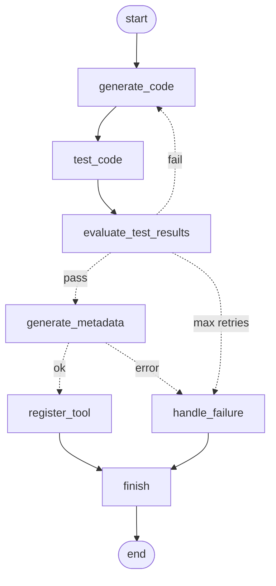

# KubeIntellect — Architecture

KubeIntellect is an AI-powered Kubernetes management platform built on a LangGraph multi-agent system. Users interact via natural language; a supervisor LLM routes requests to specialized worker agents that execute Kubernetes operations via the official Python client, with mandatory human-in-the-loop approval for all write operations.

---

## System Layers

| Layer | Role |
|---|---|
| **User Interaction** | Receives natural language queries; presents human-readable results (LibreChat UI, CLI, MCP server) |
| **Query Processing** | LLM interprets user intent; detects out-of-scope queries and handles them inline |
| **Task Orchestration** | LangGraph StateGraph routes tasks to the appropriate specialized agent |
| **Agent Execution** | 14 domain-specific agents execute Kubernetes operations as ReAct loops |
| **Kubernetes Interaction** | Kubernetes Python client — read and write operations against the cluster API |
| **Persistence** | PostgreSQL (checkpoints, context, tool registry, audit log) + MongoDB (chat history) + PVC (generated tool files) |
| **Security & Governance** | Kubernetes RBAC via Helm, AST sandbox for generated code, SHA-256 tool integrity, audit log |
| **Observability** | Langfuse (LLM traces), Prometheus + Grafana (metrics), Loki + Promtail (logs) |

---

## Request Flow

```
User query
  → LibreChat UI (POST /v1/chat/completions)
  → Memory Orchestrator (load reflections + failure hints + user prefs + registered tools)
  → Supervisor LLM (LangGraph StateGraph routing)
  → Specialized agent(s) (ReAct loops → Kubernetes API)
  → [HITL gate if write operation]
  → Streaming SSE response
```

---

## Full Architecture Diagram

```mermaid
---
config:
  flowchart:
    curve: basis
---
graph TD

User(["👤 User"]):::ext
K8S(["⎈ Kubernetes Cluster"]):::k8s

subgraph CORE["Core System"]
  direction TB
  UIL["🖥️ User Interaction Layer\nLibreChat · REST /chat/completions"]:::layer
  QPM["🔍 Query Processing\nLLM scope filter · OOS rejection · clarification"]:::layer

  subgraph ORCH["Task Orchestration Layer"]
    direction TB
    MO["🧠 Memory Orchestrator  ≤550 tokens pinned\n① Reflections  ② Failure Hints  ③ User Prefs  ④ Registered Tools"]:::mem
    SUP{{"🎛️ Supervisor LLM\nLangGraph StateGraph routing"}}:::sup
    HITL["🔒 HITL Gates  interrupt_before\nCodeGenerator · Apply"]:::hitl
  end

  subgraph AGENTS["Agent & Tool Execution Layer  (ReAct loops)"]
    direction LR
    subgraph READ["Read / Inspect"]
      A1["Logs"]:::agent
      A2["ConfigMapsSecrets"]:::agent
      A3["RBAC"]:::agent
      A4["Metrics"]:::agent
      A5["Security"]:::agent
    end
    subgraph WRITE["Write / Exec"]
      A6["Lifecycle"]:::agent
      A7["Execution"]:::agent
      A8["Deletion"]:::agent
      A9["Infrastructure"]:::agent
      A10["Apply"]:::agent
    end
    subgraph DYN["Dynamic Tools"]
      A11["DynamicToolsExecutor"]:::dyn
      A12["CodeGenerator\ngenerate→test→register"]:::codegen
    end
    subgraph DIAG["DiagnosticsOrchestrator  LangGraph Send API"]
      DO["Dispatch"]:::diag
      DL["DiagnosticsLogs\n15s timeout"]:::diag
      DM["DiagnosticsMetrics\n15s timeout"]:::diag
      DE["DiagnosticsEvents\n15s timeout"]:::diag
      DC["DiagnosticsCollect\nbarrier sync"]:::diag
      DO -->|Send| DL & DM & DE
      DL & DM & DE --> DC
    end
  end

  KIL["⎈ Kubernetes Interaction Layer\nK8s Python Client"]:::layer
end

subgraph SUPP["Supporting Infrastructure"]
  direction TB
  LLMGW["🔁 LLM Gateway\nAzure · OpenAI · Anthropic · Google · Bedrock · Ollama · LiteLLM"]:::sup

  subgraph PG["PostgreSQL"]
    PG1["LangGraph Checkpoints\nHITL resume"]:::pgbox
    PG2["Conversation Context\nsticky namespace + resource"]:::pgbox
    PG3["Failure Patterns ×30\nkeyword match → hint injection"]:::pgbox
    PG4["User Preferences\nverbosity · format · namespace"]:::pgbox
    PG5["Tool Registry\n+ PVC /mnt/runtime-tools"]:::pgbox
    PG6["Audit Log\nuser · query · agents · latency"]:::pgbox
  end

  subgraph OBS["Observability"]
    LF["🔭 Langfuse\nLLM traces · token · cost · latency"]:::obs
    PR["📊 Prometheus + Grafana"]:::obs
    LK["📜 Loki + Promtail\nJSON logs"]:::obs
  end

  SG["🔐 Security & Governance\nK8s RBAC · AST sandbox · SHA-256 · Audit log"]:::sec
end

User -->|"NL query"| UIL
UIL -->|"response"| User
UIL --> QPM --> MO --> SUP
SUP -->|"route"| READ & WRITE & DYN
SUP -->|"HITL"| HITL
HITL -->|"approve"| A12 & A10
HITL -->|"deny"| UIL
SUP -->|"diagnose"| DO
DC -->|"evidence"| SUP
READ & WRITE & DYN --> SUP
SUP -->|"FINISH"| UIL
AGENTS --> KIL --> K8S
SUP -.->|"LLM calls"| LLMGW
LLMGW -.-> LF
SUP -.-> PG
HITL -.-> PG1
A12 -.-> PG5
SUP -.-> PR

classDef ext fill:#dfe6e9,stroke:#636e72,color:#2d3436,font-weight:bold
classDef k8s fill:#d5f5e3,stroke:#27ae60,color:#1a5e32,font-weight:bold
classDef layer fill:#ebf5fb,stroke:#2e86c1,color:#1a5276,font-weight:bold
classDef sup fill:#e8daef,stroke:#8e44ad,color:#4a235a,font-weight:bold
classDef mem fill:#e8d5f5,stroke:#7d3c98,color:#4a235a
classDef hitl fill:#fde8d8,stroke:#d35400,color:#6e2c00,font-weight:bold
classDef agent fill:#d6eaf8,stroke:#2e86c1,color:#1a5276
classDef dyn fill:#d5f5e3,stroke:#1e8449,color:#1a5e32
classDef codegen fill:#fae5d3,stroke:#ca6f1e,color:#6e2c00,font-weight:bold
classDef diag fill:#d1f2eb,stroke:#148f77,color:#0e6655
classDef obs fill:#fef9e7,stroke:#d4ac0d,color:#7d6608
classDef pgbox fill:#f4ecf7,stroke:#7d3c98,color:#4a235a
classDef sec fill:#fdedec,stroke:#c0392b,color:#78281f
```



---

## CodeGenerator Pipeline

When no existing tool covers a request, CodeGenerator synthesizes one:



---

## Supervisor Routing Logic

The Supervisor LLM handles some query types inline (no agent delegation):

| Query type | Detection | Supervisor action |
|---|---|---|
| Capability question | "what can you do?", "are you able to…" | FINISH with feature overview |
| Out-of-scope | Non-Kubernetes subject | FINISH with polite decline |
| Worker clarification | Worker asks "Which namespace?" | FINISH → user responds |
| Next step / planning | "what is the next step?", "any suggestions?" | FINISH with 3–5 context-aware suggestions |

---

## Memory System

The Memory Orchestrator assembles a pinned context (≤ 550 tokens) before each request via a single `asyncio.gather`:

| Tier | Source | Service |
|---|---|---|
| Short-term | Last `SHORT_TERM_MEMORY_WINDOW` (default 3) conversation turns | In-memory |
| Working context | Sticky namespace + resource name per conversation | `conversation_context` table (PostgreSQL) |
| Failure patterns | 30 seeded Kubernetes failure patterns, keyword-matched pre-query | `failure_patterns` table (PostgreSQL) |
| Registered tools | Enabled tools from tool registry — prevents unnecessary CodeGenerator invocations | `tool_registry` table (PostgreSQL) |

---

## Storage

| Store | Purpose | Deployed as |
|---|---|---|
| MongoDB | LibreChat chat history | Deployment + PVC |
| PostgreSQL | LangGraph checkpoints · tool registry · conversation context · reflections · audit log · failure patterns | Deployment + PVC |
| PVC (`kubeintellect-runtime-tools-pvc`) | Dynamic tool code files (`gen_<id>.py`) | PVC mounted into core pod |
| Prometheus | Time-series metrics (cluster + app) | kube-prometheus-stack |
| Loki | Log aggregation (app + workloads + events) | loki-stack |

---

## Dynamic Tool Storage: Three-Service Split

Runtime-generated tools (from CodeGenerator) flow through three separate services:

```
CodeGenerator
     │
     ▼
tool_storage_service.py          ← PVC file I/O
  Writes gen_<tool_id>.py to /mnt/runtime-tools/tools/
  Computes SHA-256 checksum
     │
     ▼
tool_registry_service.py         ← PostgreSQL metadata
  Inserts: tool_id, name, description, file_path,
           checksum, input_schema, output_schema, status
     │
     ▼  (optional, GITHUB_PR_ENABLED=true)
github_pr_service.py             ← Promotion to codebase
  Creates branch, commits code, opens PR
  Writes pr_url + pr_number back to registry
```

---

## Client Interfaces

| Client | Entry point | Use case |
|---|---|---|
| **LibreChat UI** | `http://localhost:3080` (port-forward) or Kind/AKS ingress | Chat UI; production default |
| **CLI** ([kube-q](https://github.com/MSKazemi/kube_q) · [PyPI](https://pypi.org/project/kube-q/)) | `pip install kube-q` → `kq --url <api-url>` | Terminal REPL or single-query mode |
| **MCP Server** | `uv run python -m app.mcp.server` (stdio) | Claude Desktop, VS Code, MCP clients |

### MCP Server

`app/mcp/server.py` exposes KubeIntellect as an MCP server (stdio transport).

**Tools (37):** `kubeintellect_query` (full AI workflow), `kubeintellect_approve` (HITL), plus direct Kubernetes tools — pods, deployments, services, namespaces, nodes, RBAC, metrics, and runtime tool management.

**Resources:** `k8s://pods/{namespace}`, `k8s://deployments/{namespace}`, `k8s://services/{namespace}`, `k8s://namespaces`, `k8s://nodes`, `kubeintellect://tools`, `kubeintellect://health`

**Prompts:** `debug_pod`, `investigate_namespace`, `cluster_health_check`, `scale_workload`, `audit_rbac`

**Claude Desktop config:**
```json
{
  "mcpServers": {
    "kubeintellect": {
      "command": "uv",
      "args": ["run", "python", "-m", "app.mcp.server"],
      "cwd": "/path/to/kubeintellect",
      "env": { "KUBEINTELLECT_API_URL": "http://localhost:8000" }
    }
  }
}
```

---

## Observability

**KubeIntellect app:**

| Signal | Tool |
|---|---|
| LLM traces (tokens, cost, latency, prompts) | Langfuse (self-hosted) |
| HTTP metrics + custom agent counters | Prometheus via `/metrics` |
| Structured JSON logs | Loki via Promtail |
| HITL decisions, workflow duration | Prometheus custom counters |

Custom counters (`app/utils/metrics.py`):
- `kubeintellect_agent_invocations_total{agent}`
- `kubeintellect_workflow_duration_seconds`
- `kubeintellect_hitl_decisions_total{decision}`

**Managed cluster:** kube-prometheus-stack, Loki + Promtail, kubernetes-event-exporter, MongoDB + PostgreSQL exporters. See [`docs/observability.md`](observability.md).

---

## Project Structure

```
app/
├── main.py                          # FastAPI app entry point
├── core/
│   ├── config.py                    # All settings (Pydantic BaseSettings)
│   └── llm_gateway.py               # LLM factory (Azure, OpenAI, Anthropic, Google, Bedrock, Ollama)
├── api/v1/
│   └── endpoints/
│       ├── chat_completions.py      # Main chat endpoint, HITL handling, streaming
│       └── tools.py                 # Dynamic tool management API
├── orchestration/
│   ├── workflow.py                  # Graph construction, run_kubeintellect_workflow()
│   ├── agents.py                    # Agent definitions (tools + system prompts)
│   ├── routing.py                   # Supervisor chain and router node
│   ├── state.py                     # AGENT_MEMBERS, KubeIntellectState
│   └── diagnostics.py               # DiagnosticsOrchestrator fan-out nodes
├── agents/tools/
│   ├── kubernetes_tools.py          # Aggregates all static tool categories
│   └── tools_lib/                   # One file per K8s resource type
│       ├── pod_tools.py
│       ├── deployment_tools.py
│       ├── log_store_tools.py        # Loki LogQL queries
│       ├── prometheus_query_tools.py # PromQL queries
│       └── ...
├── services/
│   ├── kubernetes_service.py
│   ├── tool_registry_service.py
│   ├── tool_storage_service.py
│   ├── conversation_context_service.py
│   ├── memory_orchestrator.py
│   ├── failure_pattern_service.py
│   └── user_preference_service.py
├── mcp/
│   └── server.py                    # MCP server — 37 tools, 7 resources, 5 prompts
└── utils/
    ├── ast_validator.py             # K8s API whitelist — hallucination detection
    ├── code_security.py             # AST static analysis + SHA-256 checksum
    ├── postgres_checkpointer.py     # LangGraph HITL state checkpointing
    └── metrics.py                   # Prometheus custom counters
```
