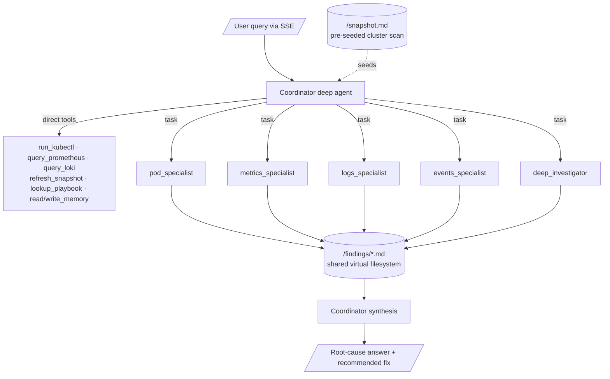

# Architecture

KubeIntellect v3 is built on the [DeepAgents](https://pypi.org/project/deepagents/)
framework. A single compiled **coordinator** agent owns the cluster tools and a
shared virtual filesystem, and dispatches **specialist subagents** for complex,
multi-domain investigations. One LangGraph checkpointer (PostgreSQL or SQLite)
persists every thread so Human-in-the-Loop approvals can resume hours later.

```mermaid
flowchart TD
    User[/User query via SSE/] --> Coord[Coordinator deep agent]
    Snap[(/snapshot.md<br/>pre-seeded cluster scan)] -.seeds.-> Coord
    Coord -->|direct tools| Tools[run_kubectl · query_prometheus · query_loki<br/>refresh_snapshot · lookup_playbook · read/write_memory]
    Coord -->|task| Pod[pod_specialist]
    Coord -->|task| Met[metrics_specialist]
    Coord -->|task| Log[logs_specialist]
    Coord -->|task| Evt[events_specialist]
    Coord -->|task| Deep[deep_investigator]
    Pod & Met & Log & Evt & Deep --> Findings[(/findings/*.md<br/>shared virtual filesystem)]
    Findings --> Synth[Coordinator synthesis]
    Synth --> Out[/Root-cause answer + recommended fix/]
```

---

## Coordinator

The coordinator is a `create_deep_agent(...)` graph compiled once at startup
(`app/agent/main_agent.py`). It runs on `get_coordinator_llm()` and is given:

- **Direct tools** — `run_kubectl`, `query_prometheus`, `query_loki`,
  `refresh_snapshot`, `lookup_playbook`, `read_memory`, `write_memory`.
- **Framework tools** (added automatically by DeepAgents) — a virtual filesystem
  (`read_file` / `write_file` / `ls`), `write_todos` for visible plans, and
  `task` to dispatch subagents.
- **System prompt** — `MAIN_INSTRUCTIONS` (`app/agent/prompts.py`), which encodes
  the gather-then-conclude discipline, the dispatch heuristics, and the kubectl
  safety rules.

The coordinator answers simple/snapshot-resolvable questions directly and
**dispatches subagents** for root-cause-shaped questions (any "why / investigate /
diagnose" verb, or anything needing ≥3 tool calls).

### Dispatch discipline

Each `model → tools` cycle in LangGraph costs two supersteps. To keep complex
investigations from exhausting the graph step budget, the coordinator is
instructed to stop after at most two direct `kubectl` calls and dispatch the
specialists instead. The run config sets `recursion_limit: 100`
(`app/agent/runner.py`) to cover the deepest subagent-nested scenarios — the
graph default of 25 is too low and was the single largest source of failed
investigations before it was raised.

---

## Specialist subagents

Five specialists are defined in `app/agent/subagents.py`. They run on the
smaller, cheaper `get_subagent_llm()` and each writes its result to
`/findings/<name>.md` in the shared virtual filesystem, which the coordinator
reads back during synthesis.

| Subagent | Tools | Use for |
|---|---|---|
| `pod_specialist` | `run_kubectl` | CrashLoopBackOff, OOMKilled, ImagePullBackOff, probe failures, restarts |
| `metrics_specialist` | `query_prometheus` | CPU/memory/saturation, SLOs, resource trends |
| `logs_specialist` | `query_loki` | error-message hunts, log-volume spikes, cross-pod log correlation |
| `events_specialist` | `run_kubectl` | scheduling failures, FailedMount, eviction, control-plane/node symptoms |
| `deep_investigator` | `run_kubectl`, `query_prometheus`, `query_loki` | cross-domain probes: NetworkPolicy validation, metric+log correlation, RBAC audit |

The first four mirror v2's domain experts. The fifth is a catch-all with the full
tool surface for unusual probes that don't fit a single domain. Subagents run
concurrently when the coordinator dispatches more than one in a single step.

---

## Snapshot pre-seeding

Before a turn starts (and only when it is **not** a HITL resume),
`seed_snapshot_state()` writes a cluster scan to `/snapshot.md` so the agent
begins already informed (`app/agent/runner.py` → `app/tools/snapshot_tool.py`).
The seed also surfaces a `snapshot` status event with the pod count and whether
any issues/warnings were detected. On a healthy cluster the coordinator is biased
toward answering list-shaped, read-only questions straight from the snapshot
without an extra `kubectl get pods`. See
[Agent Behaviors → Snapshot sufficiency gate](agent-behaviors.md#snapshot-sufficiency-gate).

---

## Human-in-the-Loop (HITL)

Write/destructive `kubectl` verbs call LangGraph's `interrupt()` inside
`run_kubectl`, which freezes the thread in the checkpointer and emits a
`HitlRequestEvent`. The next user message on the same `X-Session-ID` is
interpreted as approve/deny and the thread resumes via `Command(resume=…)`
(`app/agent/runner.py`). There is no timeout — the approval can arrive much
later because the full graph state lives in PostgreSQL/SQLite. See the
[Security model → HITL gate](security.md#4-hitl-human-in-the-loop-gate) for the
risk classification and role interaction.

---

## Streaming bridge (SSE)

`run_session()` runs one turn as a background task and translates
`graph.astream_events(..., version="v2")` into typed events on a per-session
queue, which the `/v1/chat/completions` endpoint serialises as OpenAI-compatible
SSE chunks:

| Graph event | Emitted as |
|---|---|
| coordinator `on_chat_model_stream` | `TokenEvent` (streamed answer text) |
| `run_kubectl` / `query_*` / `lookup_playbook` / `*_memory` start/end | `ToolCallEvent` / `ToolResultEvent` |
| `task` start | `StatusEvent(phase="dispatching")` |
| `write_file` to `/findings/*` | `StatusEvent(phase="investigating")` |
| `write_todos` | `PlanEvent` (visible investigation plan) |
| pending `interrupt()` | `HitlRequestEvent` |

**Subagent tokens are filtered out** of the user-visible stream: subagent LLM
calls run nested inside the `task` tool, so their `on_chat_model_stream` events
carry 4+ `parent_ids` and are skipped — only the coordinator's synthesis text
reaches the user. Internal plumbing tools (`read_file`, `write_file`, `ls`,
`task`) are likewise not surfaced as tool events.

---

## Persistence

`init_graph()` builds the checkpointer at startup:

- **PostgreSQL** (`AsyncPostgresSaver`) — default, for multi-replica deployments.
- **SQLite** (`AsyncSqliteSaver`) — when `USE_SQLITE=true`, for single-node / local.

The compiled graph is a process singleton (`get_graph()`), built lazily on first
use and torn down on shutdown via `close_graph()`.

---

## Relationship to v2

v2 used a hand-wired LangGraph supervisor routing to domain agents. v3 keeps the
same five behavioral disciplines (see [Agent Behaviors](agent-behaviors.md)) but
delegates orchestration, the virtual filesystem, and subagent dispatch to the
DeepAgents framework. The cluster tools, the snapshot, the playbook library, the
HITL gate, and the role/namespace security model are unchanged in intent — what
changed is *who runs the loop*: the framework, not bespoke routing code.
