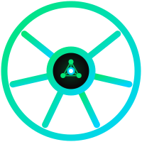

<div class="ki-hero">
  <div class="ki-hero-inner">
    
    <h1 class="ki-wordmark"><span>KUBE</span><span class="ki-green">INTELLECT</span></h1>
    <p class="ki-tagline">AI DEVOPS ENGINEER FOR KUBERNETES</p>
    <p class="ki-hero-desc">
      Diagnose CrashLoopBackOff, pending pods, and RBAC issues in plain English.
      Parallel specialist agents investigate your cluster — a human-approval gate
      waits before any write operation runs.
    </p>
    <div class="ki-ctas">
      <a href="quickstart/" class="md-button md-button--primary">Get Started →</a>
      <a href="https://github.com/MSKazemi/kubeintellect" class="md-button">View on GitHub</a>
    </div>
  </div>
</div>

<div class="ki-stats">
  <div class="ki-stat">
    <span class="ki-stat-value">6</span>
    <span class="ki-stat-label">LLM providers</span>
  </div>
  <div class="ki-stat">
    <span class="ki-stat-value">4</span>
    <span class="ki-stat-label">Parallel subagents</span>
  </div>
  <div class="ki-stat">
    <span class="ki-stat-value">3</span>
    <span class="ki-stat-label">Role tiers</span>
  </div>
  <div class="ki-stat">
    <span class="ki-stat-value">HITL</span>
    <span class="ki-stat-label">All write ops gated</span>
  </div>
</div>

---

## What it does

<div class="grid cards" markdown>

-   :material-kubernetes: **Kubernetes Intelligence**

    ---

    Runs `kubectl` across get, describe, logs, top, events, apply, scale, and delete.
    Routes complex diagnostics to four parallel specialist subagents (pod, metrics, logs, events)
    and synthesises findings into a single root-cause report.

-   :material-chart-line: **Metrics + Logs**

    ---

    Native Prometheus PromQL and Loki LogQL integration. The coordinator automatically
    delegates to the right data source — you ask in plain English, it picks the tool.

-   :material-shield-check: **Safety Gates**

    ---

    Every destructive operation pauses for human approval before kubectl is called.
    Three role tiers (admin / operator / readonly) limit what each API key can request.
    Shell injection is blocked before any subprocess runs.

-   :material-brain: **Stateful Conversations**

    ---

    Sessions are checkpointed in PostgreSQL or SQLite. Ask follow-up questions, approve
    a pending action hours later, or replay a session post-mortem — all in the same thread.

</div>

---

## See it in action

<div class="ki-terminal">
  <div class="ki-terminal-bar">
    <span class="ki-terminal-dot red"></span>
    <span class="ki-terminal-dot amber"></span>
    <span class="ki-terminal-dot green"></span>
    <span class="ki-terminal-title">kq — KubeIntellect CLI</span>
  </div>
  <div class="ki-terminal-body">
    <div><span class="prompt">❯</span> <span class="cmd">kq</span></div>
    <div class="dim">Connected to KubeIntellect · cluster: prod-aks · namespace: default</div>
    <br/>
    <div><span class="prompt">You</span> <span class="cmd">why is the payments pod crashing?</span></div>
    <br/>
    <div class="output">  Dispatching to DiagnosticsOrchestrator …</div>
    <div class="output">  ├─ pod-agent     → OOMKilled (exit 137, last 3 restarts)</div>
    <div class="output">  ├─ metrics-agent → memory.working_set spiking to 512 Mi (limit: 256 Mi)</div>
    <div class="output">  └─ log-agent     → "java.lang.OutOfMemoryError: Java heap space"</div>
    <br/>
    <div><span class="hi">Root cause:</span> <span class="cmd">payments-api is hitting its memory limit.</span></div>
    <div class="cmd">Heap dump shows unbounded cache growth in PaymentSessionCache.</div>
    <br/>
    <div><span class="hi">Proposed fix:</span> <span class="cmd">patch memory limit → 512 Mi + add cache eviction policy.</span></div>
    <br/>
    <div><span class="warn">⚠ Requires approval before kubectl patch runs.</span></div>
    <div><span class="prompt">You</span> <span class="cmd">approve</span></div>
    <div class="output">  ✓ patched deployment/payments-api — rollout in progress</div>
  </div>
</div>

---

## How it works

```
You (kq CLI or any OpenAI-compatible client)
     │  POST /v1/chat/completions  (SSE streaming)
     ▼
┌───────────────────────────────────────────────────┐
│  Coordinator LLM                                  │
│  ┌──────────┐  ┌────────────┐  ┌───────────────┐  │
│  │  kubectl │  │ Prometheus │  │     Loki      │  │
│  │   tools  │  │   PromQL   │  │    LogQL      │  │
│  └──────────┘  └────────────┘  └───────────────┘  │
│                                                   │
│  Complex issues → fan out to 4 parallel agents:   │
│  pod │ metrics │ logs │ events → synthesise        │
└───────────────────────────────────────────────────┘
     │  HITL interrupt on every destructive command
     ▼
LangGraph checkpoint store (Postgres / SQLite)
```

Responses stream back as Server-Sent Events. The API is OpenAI-compatible — point any
SSE client or your own tooling at `/v1/chat/completions`.

---

## Pick your path

<div class="grid cards" markdown>

-   **:material-lightning-bolt: Quickest — no cluster**

    ---

    `pip install kubeintellect` + SQLite. Explore the API and CLI in minutes, no Kubernetes needed.

    [→ Install guide](install/no-cluster.md)

-   **:material-server-network: Existing cluster**

    ---

    Connect KubeIntellect to any cluster you already have — AKS, EKS, GKE, or any kubeconfig.

    [→ Install guide](install/existing-cluster.md)

-   **:material-docker: Docker Compose**

    ---

    Full local stack with PostgreSQL, optional Prometheus + Grafana + Loki, and optional Langfuse LLM tracing.

    [→ Deploy guide](deploy/docker-compose.md)

-   **:material-cloud-upload: Production (Helm)**

    ---

    Helm chart for AKS / EKS / GKE. Includes RBAC, secrets management, ingress, and resource limits.

    [→ Deploy guide](deploy/cloud.md)

</div>

---

## Quick install

=== "pip (no cluster)"

    ```bash
    pip install kubeintellect
    kubeintellect init   # setup wizard — configures LLM key,
                         # optionally creates Kind cluster,
                         # installs systemd service
    kq                   # open a new terminal — that's it
    ```

=== "Docker Compose"

    ```bash
    git clone https://github.com/MSKazemi/kubeintellect
    cd kubeintellect
    cp .env.example .env        # add your LLM key
    docker compose up -d
    kq --url http://localhost:8000
    ```

=== "Kind (local K8s)"

    ```bash
    git clone https://github.com/MSKazemi/kubeintellect
    cd kubeintellect
    make kind-cluster-create
    cp .env.example .env        # add your LLM key
    make kind-deploy-kubeintellect
    make cli                    # opens kq REPL
    ```

=== "Helm (production)"

    ```bash
    helm repo add kubeintellect https://mskazemi.github.io/kubeintellect
    helm install kubeintellect kubeintellect/kubeintellect \
      --set llm.provider=openai \
      --set llm.apiKey=<YOUR_KEY>
    ```

---

## Supported LLM providers

<div class="grid cards" markdown>

-   :material-brain: **OpenAI**

    GPT-4o, GPT-4 Turbo, GPT-3.5

-   :material-microsoft-azure: **Azure OpenAI**

    Any Azure-hosted deployment

-   :material-robot-outline: **Anthropic Claude**

    Claude 3.5 Sonnet, Haiku, Opus

-   :fontawesome-brands-google: **Google Gemini**

    Gemini 1.5 Pro / Flash

-   :fontawesome-brands-aws: **AWS Bedrock**

    Claude, Llama, Titan via Bedrock

-   :material-cube-outline: **Ollama (local)**

    Llama 3, Mistral, Qwen — offline

</div>

---

<div style="text-align:center; padding: 1rem 0 0.5rem; color: #374151; font-size: 0.78rem; letter-spacing: 0.08em; text-transform: uppercase;">
  Open-source · AGPL-3.0 · <a href="https://github.com/MSKazemi/kubeintellect" style="color: #00e676;">GitHub</a> · <a href="v1/" style="color: #64748b;">KubeIntellect v1 (legacy)</a>
</div>
